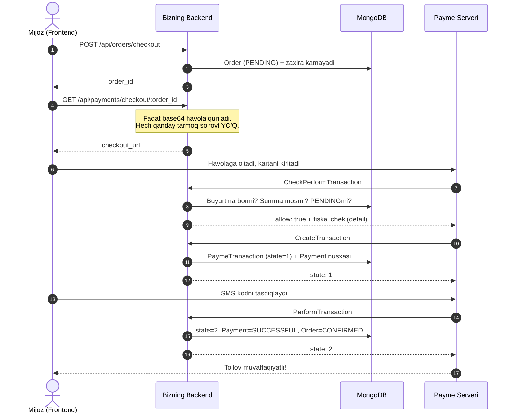

# 💳 Payme to'lov tizimi integratsiyasi

Bu hujjat ushbu loyihada (NestJS + Prisma + MongoDB) Payme **Merchant API** qanday
ishlashini, **sizdan nima talab qilinishini** va **Payme'dan nimalarni olishingiz
kerakligini** batafsil tushuntiradi.

Kod allaqachon yozilgan va sinovdan o'tgan. Sizga qoladigan ish — Payme
tomonidagi hujjatlar va kalitlarni olish, `.env` ni to'ldirish va test
kassasida tekshirish.

> 📎 **Ikkita yordamchi hujjat:**
> - [PAYME_MANAGER_REQUEST.md](PAYME_MANAGER_REQUEST.md) — Payme menejeriga
>   **yuboriladigan** ruscha texnik xat: endpoint, metodlar, so'rov/javob
>   namunalari va ulardan so'raladigan qiymatlar ro'yxati.
> - [prisma/catalog/IKPU.md](prisma/catalog/IKPU.md) — 8 kategoriya bo'yicha
>   IKPU/MXIK kodlarini to'ldirish varaqasi. Holatni
>   `npm run db:check:ikpu` bilan tekshirasiz.

---

## 📌 Mundarija

1. [Eng muhimi: nima ishlaydi va nima sizdan kutilmoqda](#1-eng-muhimi)
2. [Payme'dan nimalar kerak va qanday olinadi](#2-paymedan-nimalar-kerak)
3. [Fiskalizatsiya: IKPU/MXIK kodlari](#3-fiskalizatsiya-ikpumxik-kodlari)
4. [`.env` ni to'ldirish](#4-env-ni-toldirish)
5. [To'lovning to'liq sikli](#5-tolovning-toliq-sikli)
6. [Frontend nima qiladi](#6-frontend-nima-qiladi)
7. [JSON-RPC metodlari](#7-json-rpc-metodlari)
8. [Ma'lumotlar bazasi tuzilmasi](#8-malumotlar-bazasi-tuzilmasi)
9. [Xatolik kodlari](#9-xatolik-kodlari)
10. [Test kassasida sinash](#10-test-kassasida-sinash)
11. [Ishga tushirishdan oldingi tekshiruv ro'yxati](#11-tekshiruv-royxati)
12. [Tez-tez uchraydigan muammolar](#12-tez-tez-uchraydigan-muammolar)

---

## 1. Eng muhimi

### Bitta jumlada

**Biz Payme'ga so'rov yubormaymiz — Payme BIZGA so'rov yuboradi.**

Ko'pchilik shu yerda adashadi. Bizning backend Payme'ning API'siga murojaat
qilmaydi. Biz shunchaki **havola quramiz** (oddiy base64 satr, hech qanday
tarmoq so'rovisiz), mijoz o'sha havolaga o'tadi, kartasini kiritadi, va
**Payme serveri bizning serverimizga** JSON-RPC so'rovlarini yuboradi.

Demak, bizning server **internetdan ochiq** bo'lishi shart. `localhost` da
Payme sizga yeta olmaydi (buning yechimi 10-bo'limda).

### Ikkita yo'nalish

| Yo'nalish | Endpoint | Kim chaqiradi | Nima qiladi |
| :-- | :-- | :-- | :-- |
| Chiquvchi | `GET /api/payments/checkout/:order_id` | Frontend (JWT bilan) | Faqat **havola** qaytaradi. To'lovni yakunlamaydi. |
| Kiruvchi | `POST /api/payments/payme` | **Payme serveri** | To'lovni haqiqatda amalga oshiradi. |

> ⚠️ **Diqqat:** `checkout` hech qachon buyurtmani "to'langan" deb belgilamaydi.
> Buyurtma faqat Payme `PerformTransaction` chaqirganda `CONFIRMED` bo'ladi.
> Aks holda kimdir shunchaki havola so'rab, pul to'lamasdan tovar olardi.

### Sizdan nima kutilmoqda

1. Payme bilan **shartnoma** tuzish va test kabinetini ochtirish.
2. `PAYME_MERCHANT_ID` va `PAYME_KEY` ni olish.
3. Tovarlaringiz uchun **IKPU (MXIK) kodlarini** aniqlash.
4. Serverni **HTTPS domenga** joylashtirish va kabinetda webhook manzilini
   ko'rsatish.
5. Test kassasida sinash → Payme tasdiqlagach prod kalitlariga o'tish.

---

## 2. Payme'dan nimalar kerak

### 2.1. Kim bilan bog'lanish kerak

Payme (Paycom) bilan integratsiya **yuridik shaxs** (MChJ, YaTT) orqali amalga
oshiriladi. Aloqa yo'llari:

- **Sayt:** <https://business.payme.uz> — "Hamkor bo'lish" / "Подключиться"
- **Telefon:** +998 78 150-00-00
- **Merchant hujjatlari:** <https://developer.help.paycom.uz>
- **Texnik yordam:** integratsiya boshlangach sizga alohida Telegram guruh
  yoki menejer biriktiriladi — barcha texnik savollarni o'sha yerga bering.

### 2.2. Ular sizdan so'raydigan hujjatlar

Tayyorlab qo'ying (odatiy ro'yxat, aniq talab menejerdan so'raladi):

- Guvohnoma (MChJ/YaTT ro'yxatdan o'tganligi haqida)
- STIR (INN) va bank rekvizitlari
- Direktor pasporti nusxasi
- Sayt manzili (ishlaydigan, tovarlar va narxlar ko'rinadigan)
- **Ommaviy oferta** (public offer) sahifasi — saytda bo'lishi majburiy
- Qaytarish (vozvrat) siyosati sahifasi

### 2.3. ⭐ Ular sizga beradigan qiymatlar

Menejerdan **aynan shu ro'yxatni** so'rang:

| Nima | `.env` dagi nomi | Ko'rinishi | Izoh |
| :-- | :-- | :-- | :-- |
| Kassa identifikatori | `PAYME_MERCHANT_ID` | 24 belgili hex, masalan `65a1f3...` | Test va prod uchun **har xil** |
| Maxfiy kalit | `PAYME_KEY` | uzun tasodifiy satr | Test va prod uchun **har xil**. Hech kimga bermang. |
| Kabinet kirish ma'lumotlari | — | login/parol | Test: `test.paycom.uz`, prod: `merchant.paycom.uz` |

### 2.4. ⭐ Siz ularga beradigan qiymatlar

| Nima | Qiymat | Izoh |
| :-- | :-- | :-- |
| Endpoint (webhook) manzili | `https://api.ocomarket.uz/api/payments/payme` | **HTTPS majburiy** |
| `account` maydonining nomi | `order_id` | Payme buyurtma ID'sini shu nom bilan yuboradi |
| Valyuta | `UZS` | |
| Qaytish manzili | `https://ocomarket.uz/orders` | To'lovdan keyin mijoz shu yerga qaytadi |

> 💬 **Menejerga yuboradigan xabar namunasi:**
>
> "Assalomu alaykum. Merchant API (JSON-RPC) integratsiyasini boshlamoqchimiz.
> Bizning endpoint: `https://api.ocomarket.uz/api/payments/payme`.
> `account` maydonining nomi — `order_id` (bu bizning buyurtma ID'imiz, UUID
> formatida). Test kassasi uchun `MERCHANT_ID` va `KEY` bering, iltimos.
> Shuningdek test kabinetiga kirish ma'lumotlarini ham yuboring."
>
> To'liq texnik xat — [PAYME_MANAGER_REQUEST.md](PAYME_MANAGER_REQUEST.md).

### 2.5. Kabinetda nima sozlanadi

Test kabineti (`https://test.paycom.uz`) ga kirgach:

1. **Кассы → sizning kassangiz → Настройки**
2. **Endpoint / URL** maydoniga: `https://api.ocomarket.uz/api/payments/payme`
3. **Способ оплаты / Метод:** `Merchant API` (yoki `JSON-RPC`)
4. **Поля счёта (account):** bitta maydon qo'shing — nomi `order_id`,
   turi `Строка` (satr), majburiy ✅
5. Kalitni oling: **Настройки → Ключ** (yoki menejerdan)

> ⚠️ 4-qadam eng ko'p xato qilinadigan joy. Agar kabinetda maydonni boshqacha
> nomlasangiz (masalan `zakaz` yoki `order`), `.env` dagi
> `PAYME_ACCOUNT_FIELD` ni ham **aynan o'sha nom** bilan almashtiring.
> Aks holda har bir to'lov `-31050` ("buyurtma topilmadi") bilan tugaydi.

---

## 3. Fiskalizatsiya: IKPU/MXIK kodlari

### Nega kerak

O'zbekiston qonunchiligiga ko'ra har bir onlayn to'lov uchun **fiskal chek**
soliq organiga (OFD) yuborilishi shart. Payme bu chekni o'zi yuboradi, lekin
**tovar ma'lumotlarini bizdan so'raydi** — `CheckPerformTransaction` javobidagi
`detail` obyektida.

Agar IKPU kodi bo'lmasa, Payme to'lovni fiskallashtira olmaydi va tranzaksiyani
rad etadi. Shuning uchun kodimiz IKPU topilmasa **to'lovdan oldin** `-31008`
qaytaradi — pul yechilgandan keyin xato chiqargandan ko'ra shunisi yaxshi.

### Kodlarni qayerdan olish

| Nima | Qayerdan |
| :-- | :-- |
| **IKPU / MXIK** (17 xonali tovar kodi) | <https://tasnif.soliq.uz> — tovar nomi bo'yicha qidiring |
| **Package code** (qadoqlash kodi) | O'sha saytda IKPU tanlangach ro'yxat chiqadi |
| **QQS stavkasi** (`vat_percent`) | Buxgalteringizdan so'rang: 0 (QQS to'lovchisi emas) yoki 12 |
| **O'lchov birligi** (`units`) | tasnif.soliq.uz; dona = `241092` |

> 💡 **Maslahat:** buxgalteringiz yoki soliq maslahatchingiz bilan birga
> to'ldiring. Noto'g'ri IKPU — soliq jarimasi degani. Payme menejeri ham
> odatda yordam beradi.

### Loyihada qanday saqlanadi

IKPU tovar **guruhiga** beriladi, alohida modelga emas — shuning uchun uning
asosiy joyi `Category`:

1. **Kategoriyada** (asosiy) — `Category.ikpu_code`, `package_code`,
   `vat_percent`, `units`. Bitta kategoriyani to'ldirsangiz ichidagi hamma
   mahsulot shuni oladi: 8 ta qator = 54 ta mahsulot.
2. **Mahsulotda** (istisno) — `Product` da xuddi shu 4 maydon, kategoriyanikini
   **qoplaydi**. Kerak bo'ladi, chunki «Инструменты» kategoriyasida ikkita
   butunlay boshqa guruh bor: payvandlash apparati va elektrodvigatel.

```
Product.ikpu_code  bor  →  o'shani ishlatadi
                   yo'q →  Category.ikpu_code
                           yo'q → -31008, to'lov to'xtaydi
```

> `.env` dagi eski `PAYME_DEFAULT_*` zaxirasi **olib tashlangan**: u bitta
> kodni butun katalogga qo'llardi, ya'ni stabilizator ham nasos deb
> fiskallashardi. Endi bo'shliq jimgina noto'g'ri chek emas, aniq xato beradi.

**To'ldirish varaqasi:** [prisma/catalog/IKPU.md](prisma/catalog/IKPU.md) — 8
kategoriyaning har biri uchun `tasnif.soliq.uz` da nima qidirish kerakligi va
qaysi SKU'lar shu guruhga kirishi yozilgan. Kodlarni ommaviy kiritish uchun
`prisma/catalog/products.json` ni tahrirlab `npm run db:import:catalog` ni
bajaring.

**Holatni tekshirish:**

```bash
npm run db:check:ikpu          # yetishmayotgan maydonlarni ko'rsatadi
npm run db:check:ikpu -- --all # barcha mahsulotlarni ro'yxatlaydi
```

### Muhim qoida: chek yig'indisi

Payme quyidagi tenglikni talab qiladi:

```
AMOUNT == Σ((price × count) − discount)
```

Ya'ni chek qatorlari yig'indisi to'lov summasiga **aniq** teng bo'lishi shart.
Kod buni `CheckPerformTransaction` da oldindan tekshiradi va mos kelmasa
`-31001` qaytaradi.

> ⚠️ **Kelajakda yetkazib berish narxi (dostavka) qo'shsangiz:** uni buyurtma
> summasiga qo'shib qo'yish yetarli emas — u **alohida chek qatori** bo'lishi
> va o'z IKPU kodiga ega bo'lishi kerak. Aks holda tenglik buziladi va barcha
> to'lovlar to'xtaydi.

---

## 4. `.env` ni to'ldirish

```env
# --- Payme'dan olinadi (ALMASHTIRISH SHART) --------------------------------
PAYME_MERCHANT_ID="000000000000000000000000"
PAYME_KEY="payme_bergan_maxfiy_kalit"

# --- Kassa manzili ---------------------------------------------------------
# Test:  https://test.paycom.uz
# Prod:  https://checkout.paycom.uz
PAYME_CHECKOUT_URL="https://test.paycom.uz"

# Kabinetdagi account maydonining nomi (kabinet bilan bir xil bo'lishi shart)
PAYME_ACCOUNT_FIELD="order_id"

# To'lovdan keyin mijoz qaytariladigan sahifa (frontend, backend emas)
PAYME_RETURN_URL="https://ocomarket.uz/orders"

# Fiskalizatsiya uchun `.env` da HECH NARSA yo'q - qiymatlar bazada,
# Category (asosiy) va Product (istisno) modellarida.
```

**Server ishga tushganda o'zi tekshiradi.** Agar biror narsa yetishmasa,
loglarda ogohlantirish chiqadi:

```
[PaymeService] Payme to'liq sozlanmagan: PAYME_KEY. To'lov ishlamaydi.
[PaymeService] Fiskal ma'lumotsiz kategoriya: Инструменты. Ulardagi mahsulotlar uchun to'lov -31008 bilan to'xtaydi. Tekshirish: npm run db:check:ikpu
[PaymeService] Payme TEST kassasi ishlatilmoqda (test.paycom.uz) - haqiqiy pul o'tmaydi.
```

Ikkinchi qator prod'da chiqsa — `PAYME_CHECKOUT_URL` ni almashtirishni unutgansiz.

---

## 5. To'lovning to'liq sikli



### Buyurtma holatlarining o'zgarishi

| Bosqich | `Order.status` | `Payment.status` | `PaymeTransaction.state` |
| :-- | :-- | :-- | :-- |
| Savatdan buyurtma | `PENDING` | — | — |
| `CreateTransaction` | `PENDING` | `PENDING` | `1` (CREATED) |
| `PerformTransaction` | **`CONFIRMED`** | `SUCCESSFUL` | `2` (PERFORMED) |
| To'lovsiz bekor | `PENDING` | `FAILED` | `-1` (CANCELLED) |
| Pul qaytarilsa | `CANCELLED` + zaxira qaytadi | `REFUNDED` | `-2` |

---

## 6. Frontend nima qiladi

### 1-qadam: buyurtma yaratish

```http
POST /api/orders/checkout
Authorization: Bearer <access_token>

{ "shipping_address": "Toshkent, ...", "customer_phone": "+998901234567" }
```

Javobdan `data.id` (buyurtma ID) olinadi.

### 2-qadam: to'lov havolasini olish

```http
GET /api/payments/checkout/<buyurtma-id>
Authorization: Bearer <access_token>
```

> **Tana (body) umuman yo'q.** Buyurtma ID yo'lda keladi, boshqa hech narsa
> kerak emas.
>
> `provider` so'ralmaydi — ulangan yagona kassa Payme, servis baribir har
> doim Payme havolasini quradi. Ikkinchi provayder ulanganda maydon qaytadan
> qo'shiladi (ixtiyoriy maydon — buzuvchi o'zgarish emas).
>
> `lang` ham so'ralmaydi. Kassa oynasining tili (`l=` parametri) xaridorning
> profilidagi `user.language` dan olinadi — fiskal chek satrlari ham aynan
> o'sha tildan quriladi, ya'ni kassa va chek doim bir xil tilda chiqadi.
> Til o'zgartirish uchun foydalanuvchi profilini yangilash kifoya.

Javob:

```json
{
  "success": true,
  "language": "uz",
  "data": {
    "order_id": "7bf3b3a2-25de-4bca-81f1-b1e604fdfa89",
    "provider": "payme",
    "amount": 1500000,
    "checkout_url": "https://test.paycom.uz/bT02NWEx..."
  }
}
```

### 3-qadam: mijozni yo'naltirish

```js
window.location.href = data.checkout_url;
```

### 4-qadam: qaytgach holatni tekshirish

Mijoz `PAYME_RETURN_URL` ga qaytadi. **Bu qaytish to'lov o'tganini
ANGLATMAYDI** — mijoz shunchaki oynani yopgan bo'lishi ham mumkin. Haqiqiy
holatni serverdan so'rang:

```http
GET /api/payments/status/<order_id>
Authorization: Bearer <access_token>
```

`data.status === "SUCCESSFUL"` bo'lsa — to'lov o'tgan.

> 💡 Payme'ning `PerformTransaction` so'rovi bir necha soniya kechikishi mumkin.
> Frontend 2-3 soniyada bir marta, 30 soniya davomida so'rovni takrorlasin
> (polling), keyin "to'lov tekshirilmoqda" deb yozsin.

---

## 7. JSON-RPC metodlari

Barchasi bitta endpointga keladi: `POST /api/payments/payme`

### Umumiy qoidalar

- **HTTP status HAR DOIM `200`** — hatto xatoda ham. Xato javob tanasidagi
  `error` obyektida keladi.
- Har bir javobda `jsonrpc: "2.0"` va so'rovning `id` si qaytariladi.
- Avtorizatsiya: `Authorization: Basic base64("Paycom:<PAYME_KEY>")`.
  Solishtirish `timingSafeEqual` bilan — oddiy `===` kalitni belgima-belgi
  taxmin qilishga yo'l ochib beradi.
- Summalar **tiyinda** (1 so'm = 100 tiyin).
- **Har bir metod idempotent** — Payme tarmoq uzilishida so'rovni qaytaradi,
  ikkinchi urinish birinchisi bilan bir xil natija berishi shart.

### 7.1. `CheckPerformTransaction`

To'lov mumkinmi? Kassa oynasi ochilishidan oldin so'raladi.

**Tekshiruvlar:** buyurtma bormi → summa mosmi → holati `PENDING`mi →
fiskal chek quriladimi → chek yig'indisi to'g'rimi.

**Javob:**

```json
{
  "result": {
    "allow": true,
    "detail": {
      "receipt_type": 0,
      "items": [{
        "title": "Avtomatik nasos 1WZB-250",
        "price": 75000,
        "count": 2,
        "code": "00702001001000000",
        "package_code": "1508957",
        "vat_percent": 12,
        "discount": 0
      }]
    }
  }
}
```

Chekdagi nomlar **xaridorning tilida** (`order.user.language`) — Payme'ning
so'rovida til kelmaydi, shuning uchun uni bazadan olamiz.

### 7.2. `CreateTransaction`

Tranzaksiya ochiladi, pul bron qilinadi.

- Shu `id` bilan yozuv bormi → o'shani qaytaramiz (idempotentlik).
- Buyurtmada boshqa **ochiq** tranzaksiya bormi → `-31051`.
- Buyurtma allaqachon to'langanmi → `-31052`.
- Muddati o'tgan eski tranzaksiya bo'lsa — uni yopamiz va yangisiga yo'l beramiz
  (aks holda buyurtma abadiy band bo'lib qolardi).

### 7.3. `PerformTransaction`

**Eng muhim metod** — pul shu yerda hisobga o'tadi.

`PaymeTransaction.state = 2`, `Payment.status = SUCCESSFUL`,
`Order.status = CONFIRMED` — uchalasi **bitta ma'lumotlar bazasi
tranzaksiyasida** o'zgaradi. Aks holda pul o'tib, buyurtma esa `PENDING`
bo'lib qolishi mumkin edi.

### 7.4. `CancelTransaction`

- To'lovsiz bekor qilish → `state = -1`, buyurtma o'z holicha qoladi.
- To'lovdan keyin (qaytarish) → `state = -2`, buyurtma `CANCELLED`,
  **zaxira omborga qaytariladi**, `Payment.status = REFUNDED`.
- Buyurtma allaqachon **yetkazib berilgan** bo'lsa → `-31007` (bekor qilib
  bo'lmaydi).

### 7.5. `CheckTransaction`

Tranzaksiyaning joriy holatini qaytaradi. Bekor qilingan eski tranzaksiyalar
ham topiladi — jurnal hech qachon o'chirilmaydi.

### 7.6. `GetStatement`

Payme bilan **sverka** (moliyaviy solishtiruv) uchun. `from`–`to` oralig'idagi
barcha tranzaksiyalar, bekor qilinganlari ham.

---

## 8. Ma'lumotlar bazasi tuzilmasi

Ikkita model bor va ularning vazifasi **har xil**:

### `PaymeTransaction` — protokol jurnali (haqiqat manbai)

Har bir Payme urinishi uchun **alohida yozuv**. Hech qachon qayta ishlatilmaydi.

```prisma
model PaymeTransaction {
  id             String     @id @default(uuid()) @map("_id")
  transaction_id String     @unique   // Payme tomonidagi ID
  order_id       String
  amount         Float                // so'mda
  state          PaymeState
  reason         Int?
  time           Float                // Payme yuborgan vaqt
  create_time    Float
  perform_time   Float?
  cancel_time    Float?
}
```

**Nega alohida kolleksiya?** `Payment.order_id` unikal — bitta buyurtmaga bitta
to'lov yozuvi. Payme esa har urinish uchun yangi tranzaksiya ochadi: kartada
mablag' yetmasa mijoz qaytadan uriniadi. Agar bitta yozuvni qayta ishlatsak,
avvalgi tranzaksiya ID'si o'chib ketardi va Payme keyinroq o'sha ID bilan
so'raganda "topilmadi" (`-31003`) qaytarardik — sverkada esa u umuman
ko'rinmasdi. **Bu Payme bilan hisob-kitob nomutanosibligiga olib keladi.**

### `Payment` — buyurtmaning joriy to'lov holati (nusxa)

Admin panel bitta so'rov bilan holatni ko'rishi uchun oxirgi urinishning
nusxasini saqlaydi. `payme_*` maydonlari faqat **o'sha tranzaksiyaga tegishli
bo'lsa** yangilanadi — mijoz qayta urinib yangi tranzaksiya ochgan bo'lsa,
eskisining bekor qilinishi yangisining holatini buzmasligi kerak.

### Holatlar mashinasi

| `state` | Enum | Izoh |
| :--: | :-- | :-- |
| `1` | `CREATED` | Yaratildi, to'lov kutilmoqda |
| `2` | `PERFORMED` | To'lov muvaffaqiyatli |
| `-1` | `CANCELLED` | To'lanmasdan bekor qilindi |
| `-2` | `CANCELLED_AFTER_PERFORM` | To'langandan keyin qaytarildi (refund) |

Tranzaksiya **12 soatdan** keyin eskiradi.

---

## 9. Xatolik kodlari

| Kod | Qachon |
| :--: | :-- |
| `-32504` | Avtorizatsiya kaliti noto'g'ri yoki yo'q |
| `-32601` | Noma'lum metod |
| `-32600` | So'rov formati noto'g'ri |
| `-31001` | Summa buyurtma summasiga mos emas (yoki chek yig'indisi buzilgan) |
| `-31003` | Tranzaksiya topilmadi |
| `-31007` | Bekor qilib bo'lmaydi — buyurtma yetkazib berilgan |
| `-31008` | Amalni bajarib bo'lmaydi (muddat o'tgan / holat mos emas / IKPU yo'q) |
| `-31050` | Buyurtma topilmadi yoki bekor qilingan |
| `-31051` | Buyurtma boshqa tranzaksiyada band |
| `-31052` | Buyurtma allaqachon to'langan |

Xato javobi shakli (HTTP status baribir `200`):

```json
{
  "jsonrpc": "2.0",
  "id": 1,
  "error": {
    "code": -31001,
    "message": { "ru": "Неверная сумма", "uz": "Noto'g'ri summa", "en": "Invalid amount" }
  }
}
```

> 🔒 **Xavfsizlik eslatmasi:** buyurtma topilmasligi, ID noto'g'ri bo'lishi va
> buyurtma bekor qilinganligi — uchalasi ham bitta xato (`-31050`) qaytaradi.
> Aks holda javoblar farqiga qarab begona buyurtma ID'larini taxmin qilish
> mumkin bo'lardi.

---

## 10. Test kassasida sinash

### 10.0. Avval LOKALDA: `npm run payme:selftest`

Payme kabinetiga chiqishdan oldin butun protokolni o'z mashinangizda tekshirib
oling. Skript Payme serverining **o'rnida turadi**: webhook'ingizga haqiqiy
JSON-RPC so'rovlarini yuboradi va javoblarni tekshiradi — kabinetdagi sandbox
testi ham xuddi shu holatlarni chaqiradi.

```bash
# 1-terminal
PAYME_KEY=test-kalit npm run start:dev

# 2-terminal
PAYME_KEY=test-kalit npm run payme:selftest
```

Skript o'ziga vaqtinchalik foydalanuvchi, mahsulot va buyurtma yaratadi va
oxirida hammasini o'chiradi — bazangizdagi ma'lumotlarga tegmaydi.

Tekshiriladigan 25 ta holat: avtorizatsiya (`-32504`), noma'lum metod
(`-32601`), **HTTP status 200**, buyurtma topilmadi (`-31050`), summa mos emas
(`-31001`), chek qatorlari va yig'indisi, `CreateTransaction` idempotentligi,
parallel tranzaksiya (`-31051`), `PerformTransaction` va buyurtma
`CONFIRMED` bo'lishi, qayta to'lash (`-31052`), `GetStatement`, qaytarish
(`state: -2`), **zaxiraning omborga qaytishi**, `REFUNDED` holati va
`-31003`.

> ⚠️ `PerformTransaction` `-31008` bilan yiqilsa — MongoDB **replica set**
> rejimida emas. Prisma `$transaction` uni talab qiladi. Tekshirish:
> `mongosh --eval 'db.adminCommand({hello:1}).setName'`

### 10.1. Serverni internetga chiqarish

Payme `localhost` ga yeta olmaydi. Ishlab chiqish paytida **ngrok**:

```bash
npm run start:dev          # 1-terminal
ngrok http 3000            # 2-terminal
```

`ngrok` bergan `https://xxxx.ngrok-free.app` manzilini oling va Payme
kabinetiga `https://xxxx.ngrok-free.app/api/payments/payme` deb kiriting.

> ⚠️ Bepul ngrok'da manzil har safar o'zgaradi — kabinetda ham yangilashni
> unutmang.

Prod uchun: domen + HTTPS sertifikat (Let's Encrypt) + nginx reverse proxy.
Loyihada `nginx.conf.example` bor.

### 10.2. Avtorizatsiyani tekshirish

Server ishlayotganini eng tez tekshirish usuli:

```bash
curl -s -X POST https://api.ocomarket.uz/api/payments/payme \
  -H "Content-Type: application/json" \
  -H "Authorization: Basic $(echo -n 'Paycom:SIZNING_KALIT' | base64)" \
  -d '{"jsonrpc":"2.0","id":1,"method":"CheckPerformTransaction",
       "params":{"amount":150000,"account":{"order_id":"<haqiqiy-order-id>"}}}'
```

Kutilgan javob: `{"jsonrpc":"2.0","id":1,"result":{"allow":true,"detail":{...}}}`

Kalitni noto'g'ri yozib ko'ring — `-32504` kelishi kerak.

### 10.3. Payme test kartalari

Test kassasida haqiqiy pul o'tmaydi. Payme test kartalarini menejeringizdan
so'rang (odatda `8600 4954 7331 6478` kabi raqamlar, SMS kodi `666666`).
Aniq raqamlar vaqt-vaqti bilan o'zgaradi — **menejerdan so'rash eng ishonchlisi**.

### 10.4. Payme sandbox testi

Payme kabinetida avtomatik test bor: u ketma-ket barcha metodlarni chaqirib,
javoblaringizni tekshiradi. Bu testdan o'tmaguningizcha prod kassasi
ochilmaydi.

Test tekshiradigan asosiy holatlar (kodda hammasi qoplangan):

- ✅ Noto'g'ri `account` → `-31050`
- ✅ Noto'g'ri summa → `-31001`
- ✅ Takroriy `CreateTransaction` → bir xil natija
- ✅ Ikkinchi parallel tranzaksiya → `-31051`
- ✅ Takroriy `PerformTransaction` → bir xil natija
- ✅ Bekor qilingandan keyin `CheckTransaction` → `-1` holati
- ✅ Noto'g'ri kalit → `-32504`

### 10.5. Loglarni kuzatish

```bash
pm2 logs                      # prod
npm run start:dev             # dev, log konsolda
```

Har bir kutilmagan xato `PaymeController` orqali loglanadi.

---

## 11. Tekshiruv ro'yxati

Prod'ga chiqishdan oldin:

- [ ] Payme bilan shartnoma imzolangan
- [ ] **Prod** `PAYME_MERCHANT_ID` va `PAYME_KEY` olingan (test'niki emas!)
- [ ] `PAYME_CHECKOUT_URL="https://checkout.paycom.uz"` ga o'zgartirilgan
- [ ] `PAYME_ACCOUNT_FIELD` kabinetdagi maydon nomi bilan bir xil
- [ ] `PAYME_RETURN_URL` haqiqiy sayt manzili
- [ ] Domen HTTPS'da, sertifikat amal qiladi
- [ ] Kabinetdagi webhook manzili: `https://api.ocomarket.uz/api/payments/payme`
- [ ] IKPU kodlari buxgalter bilan tasdiqlangan
- [ ] `npx prisma db push` bajarilgan (`PaymeTransaction` kolleksiyasi bor)
- [ ] Payme sandbox testidan o'tilgan
- [ ] `.env` git'ga tushmagan (`.gitignore` da bor)
- [ ] Loglarda "Payme to'liq sozlanmagan" ogohlantirishi **yo'q**
- [ ] Loglarda "TEST kassasi ishlatilmoqda" ogohlantirishi **yo'q**
- [ ] MongoDB **replica set** rejimida (`$transaction` uchun shart)
- [ ] Bitta haqiqiy kichik summali to'lov qilib ko'rilgan

---

## 12. Tez-tez uchraydigan muammolar

| Belgi | Sabab | Yechim |
| :-- | :-- | :-- |
| Barcha to'lovlar `-31050` | `PAYME_ACCOUNT_FIELD` kabinetdagi nomga mos emas | Kabinetdagi maydon nomini `.env` ga aynan ko'chiring |
| `-32504` doim keladi | Kalit noto'g'ri yoki test/prod kaliti almashib ketgan | Kabinetdan kalitni qayta oling |
| Lokalda `-32504`, log'da "PAYME_KEY sozlanmagan" | `.env` ga kalit qo'shilgan, lekin **eski server jarayoni** portni band qilib turibdi — yangisi `EADDRINUSE` bilan ko'tarilmagan | `lsof -ti :3000 \| xargs -r kill` → `npm run start:dev`. `.env` faqat **ishga tushishda** o'qiladi |
| `-31001` doim keladi | Chek qatorlari yig'indisi buyurtma summasiga teng emas | Loglarni qarang: aniq raqamlar yoziladi |
| `-31008` "fiscal data is not configured" | Na mahsulotda, na uning kategoriyasida IKPU / QQS stavkasi bor | `npm run db:check:ikpu` → kategoriyaga `ikpu_code` va `vat_percent` qo'ying |
| Payme umuman so'rov yubormayapti | Server internetdan ochiq emas yoki HTTPS yo'q | ngrok / domen + sertifikat |
| To'lov o'tdi, buyurtma `PENDING` | `PerformTransaction` da baza xatosi | Loglarni qarang; MongoDB replica set rejimidami? |
| `Transactions are not supported by standalone servers` | MongoDB replica set emas | Mongo'ni replica set qilib ishga tushiring (Atlas'da avtomatik) |

---

## 📁 Kod fayllari

```
src/api/payments/
├── payments.controller.ts        # /checkout/:order_id, /status, /admin/all (JWT bilan)
├── payments.service.ts           # checkout havolasi, holat, admin ro'yxati
├── payments.module.ts
├── dto/
│   └── payments-query.dto.ts     # faqat admin ro'yxati uchun; checkout DTO'siz
└── payme/
    ├── payme.controller.ts       # POST /api/payments/payme (webhook)
    ├── payme.service.ts          # 6 ta JSON-RPC metodi + avtorizatsiya
    ├── payme.receipt.ts          # fiskal chek quruvchi
    ├── payme.error.ts            # protokol xatolari (3 tilda)
    ├── payme.constants.ts        # kodlar, tiyin/so'm konvertatsiyasi
    ├── payme.types.ts            # JSON-RPC turlari
    ├── payme.service.spec.ts     # 40 ta test
    └── payme.controller.spec.ts  # 6 ta test
```

Testlarni ishga tushirish:

```bash
npx jest src/api/payments
```
